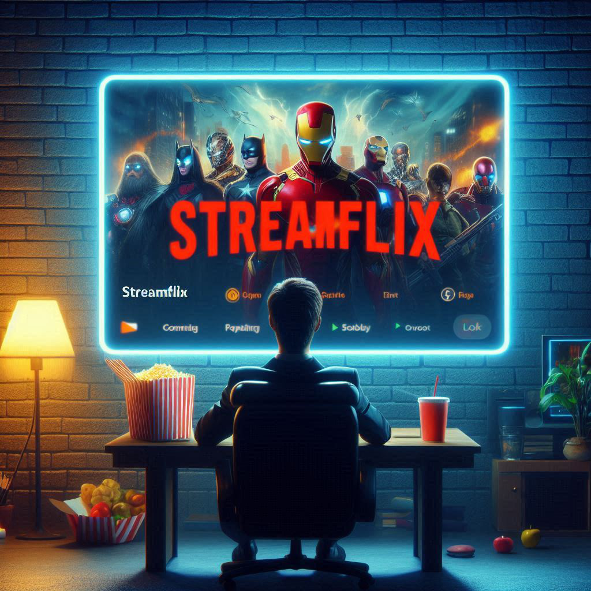
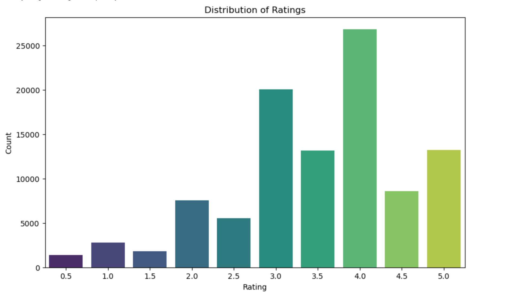
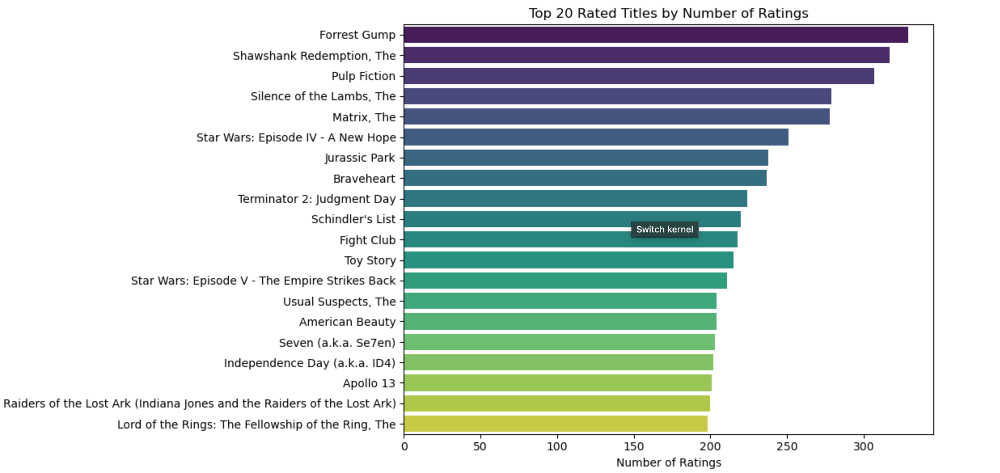

# STREAMFLIX MOVIE RECOMMENDATION SYSTEM



### Authors - Group 10
Evaclaire Wamitu - [Email](evamunyika@gmail.com)
Simon Makumi - [Email](simonmakumi5@gmail.com)

### Project Overview
StreamFlix, a leading online streaming platform, is embarking on a project to revolutionize its user experience through the implementation of a hybrid movie recommendation system. Faced with challenges in user retention and engagement, as well as user overwhelm due to an extensive movie library, StreamFlix aims to leverage the power of data science to provide personalized movie suggestions. This initiative follows the CRISP-DM methodology and utilizes both collaborative filtering and content-based filtering techniques applied to the MovieLens dataset. The primary objective of this project is to develop and deploy an accurate hybrid recommendation system that can effectively predict user preferences and output a tailored list of top 5 movie recommendations. StreamFlix anticipates to not only enhance user engagement and retention but to also set a new standard in the streaming industry for tailored content delivery.

### Problem Statement
StreamFlix is facing challenges with user retention and engagement. Users are also overwhelmed by the vast library of movies available and often spend a considerable amount of time searching for movies they would enjoy. StreamFlix is, therefore, looking for a way to provide personalized movie recommendations to its users to improve their viewing experience and increase platform usage.

This project follows the CRISP-DM methodology which entails:

## 1. Business Understanding
Online streaming services such as StreamFlix aim to enhance user experience and retention by providing personalized movie recommendations. By delivering tailored content, these services strive to meet individual user preferences making it easier for users, both new and old, to discover movies they are likely to enjoy. This personalized approach is crucial because it increases user engagement, satisfaction and loyalty leading to higher user retention rates. For the business, this means improved subscription renewals, reduced churn rates and a more competitive edge in the crowded streaming market. Ultimately, providing proper personalized recommendations will help Sttreamflix build a stronger relationship with its users thus fostering long-term growth and success.

## 2. Data Understanding
The data utilised in this project is the Movielens dataset from GroupLens Research Lab covering movie ratings from 1902 to 2018. The dataset contains 100836 ratings and 3683 tag applications across 9742 movies with each user rating at least 20 films. While the full dataset contains 1.9 million ratings, we focussed on a subset of about 100,000 for our current model due to time and resource constraints. This sample size balances computational efficiency with statistical relevance for our recommendation engine development. The datasets include `links.csv`, `movies.csv`, `ratings.csv` and `tags.csv`. The following features were utilized  in the development of our recommendation system:  `movieId`, `userId_x`, `rating`, `title` and `genres`. 
The datasets were merged on the movieId column resulting in a DataFrame with 285783  rows and 11 columns. The data was sufficient in fulfilling our objectives although additional information such as actors, directors, production studio, runtime and user demographics would have provided more context and insights into user preferences and movie characteristics leading to better recommendations.

 ## 3. Data Preparation
We address and correct errors in the dataset by handling missing values, outliers, duplicates and data type inconsistencies. Columns that are least relevant in our analysis are dropped and the userId_x column is then renamed to user_id for ease of reference. Movie release year is then extracted from the movie title column and values in the genres colum
n are split into lists for easier analysis. We then examine the properties of the DataFrame and drop missing values and duplicate rows and finally convert the user_id column data type from float64 to int64 for consistency. This ensures that the data is clean and properly formatted setting the stage for accurate modeling.

### Exploratory Data Analysis
In this exploratory data analysis (EDA), we aim to uncover patterns, trends and relationships within our dataset using visualizations and statistical techniques. 

Distribution of Ratings: The most common rating is 4.0 with about 25,000 movies, the distribution is positively skewed towards higher ratings.



Distribution of Genres: Drama is the most preffered genre with over 40,000 movies followed closely by comedy while niche genres like animation, war, IMAX, musical and Western appear to have fewer than 10,000 movies each.


Top 20 Rated Titles by Number of Ratings Plot: 'Forrest Gump' has the highest number of ratings followed by 'The Shawshank Redemption' and 'Pulp Fiction' with top-rated films having between 200 to nearly 300 ratings.



 ## 4. Modeling
A dummy model is first evaluated using the Surprise library as a baseline for the collaborative filtering system generating random predictions based on the observed distribution of ratings. This dummy model is trained and tested providing an RMSE of `1.43`. Gridsearch Cross Validation of the Singular Value Decomposition (SVD) model outputs an RMSE of `0.862` against an RMSE of `0.975` for the K-Nearest Neighbors (KNN) model identifying the `SVD` model as more superior for creating the collaborative filtering system. The `SVD` model is then assessed using cross-validation achieving a mean RMSE of approximately 0.857 and a very low standard deviation of `0.005` across 5 folds. 
A `CollabBasedModel` class trains the SVD model, collects user ratings, generates movie recommendations (with optional genre filtering) and prints the top recommendations. 
TF-IDF vectorization and cosine similarity are then encapsulated within a `ContentBasedModel` class inorder to train a content-based movie recommendation system and provide genre-based movie recommendations based on similarity to a specified movie title.
The `HybridModel` class integrates collaborative filtering and content-based filtering using a weighted average to provide hybrid recommendations with user ratings guiding the process. After training both models, the system generates and prints a list of recommended movies based on user input. The hybrid model with a collab weight of 0.5 produces an RMSE of `1.25`.
Different collaborative filtering weights are tested to determine their impact on the hybrid model's performance. starting from 0.2 up to 0.8, the RMSE values decrease indicating improved prediction accuracy. With a weight of `0.2` the RMSE is `1.2559` and with a weight of `0.4` it slightly improves to `1.2523`. The RMSE significantly drops to `1.1263` with a weight of `0.6` and further decreases to `1.1221` with a weight of `0.8`. This suggests that higher collaborative filtering weight tends to enhance the model's accuracy leading to lower prediction errors and helps in identifying the most effective balance between collaborative and content-based filtering.

### Deployment
Streamlit is a Python library used to create web applications for data science projects. In this case, streamlit is used to build an interactive movie recommendation system. The app uses a collaborative filtering model based on the `SVD` (singular value decomposition) algorithm from the Surprise library trained on user-movie ratings. Key features include displaying trending movies, personalized recommendations, movie search functionality and genre-based browsing. The app fetches movie posters from a TMDB API and attempts to show trailers using a YouTube API. The model demonstrates integration of machine learning models with a user-friendly interface including features like rating movies, receiving personalized recommendations and exploring movies by genre. 

### Conclusion
The collaborative filtering model with an RMSE of 0.86 outperforms the hybrid model, which shows higher RMSE, suggesting that emphasizing collaborative filtering in a hybrid approach yields better accuracy and recommendation quality.

### Recommendations
1. **Refine Collaborative Filtering Weights**: Experiment with smaller increments around the optimal collaborative filtering weight (e.g., between 0.6 and 0.8) to fine-tune performance.

2. **Implement Cross-Validation**: Use cross-validation to confirm that improvements in RMSE are consistent and not due to random variations or overfitting.

3. **Enhance Content-Based Model**: Incorporate detailed item features like plot summaries in content based filtering to improve recommendations especially for users with limited interaction history.

4. **Explore Advanced Techniques**: Integrate deep learning-based models and other advanced methods to further enhance the system's capabilities and address remaining limitations.

5. **Incorporate User Feedback and Regular Updates**: Integrate user feedback and conduct real-world testing to validate the model's effectiveness ensuring it meets user preferences and expectations. Regularly update the recommendation system with new data and metrics to adapt to evolving user preferences and content.

### Installation and Setup

**Clone the repository**

**https:**
```
git clone https://github.com/Eva-Claire/streamflix_recommender_system.git
```
**ssh:**
```
git@github.com:Eva-Claire/streamflix_recommender_system.git
```
**Navigate to the project directory**

```
cd streamflix_recommender_system.git
```
**Install dependencies**
```
pip install -r requirements.txt
```
**Execute the app on Streamlit**
```
streamlit run app.py
```

### Repository Setup

```
streamflix_movie_recommendation_system/
│
├── Cover Page/
│   ├── Evaclaire M.
│   └── Simon M.
│
└── Project Files/
    ├── .ipynb_checkpoints/
    ├── modelling_data/
    ├── movies_data/
    ├── project_images/
    ├── .DS_Store
    ├── README.md
    ├── Streamflix_data_report.docx
    ├── app.py
    ├── logo.png
    └── movie_recommendor.ipynb
```
